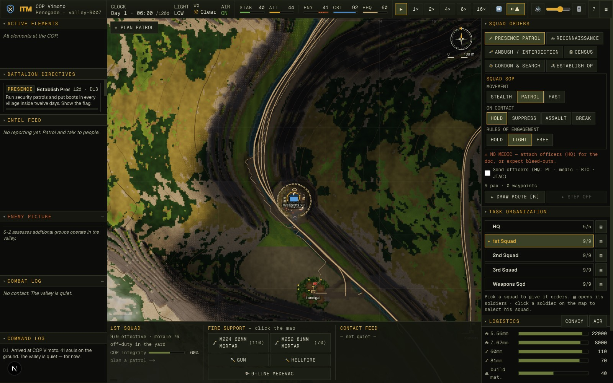
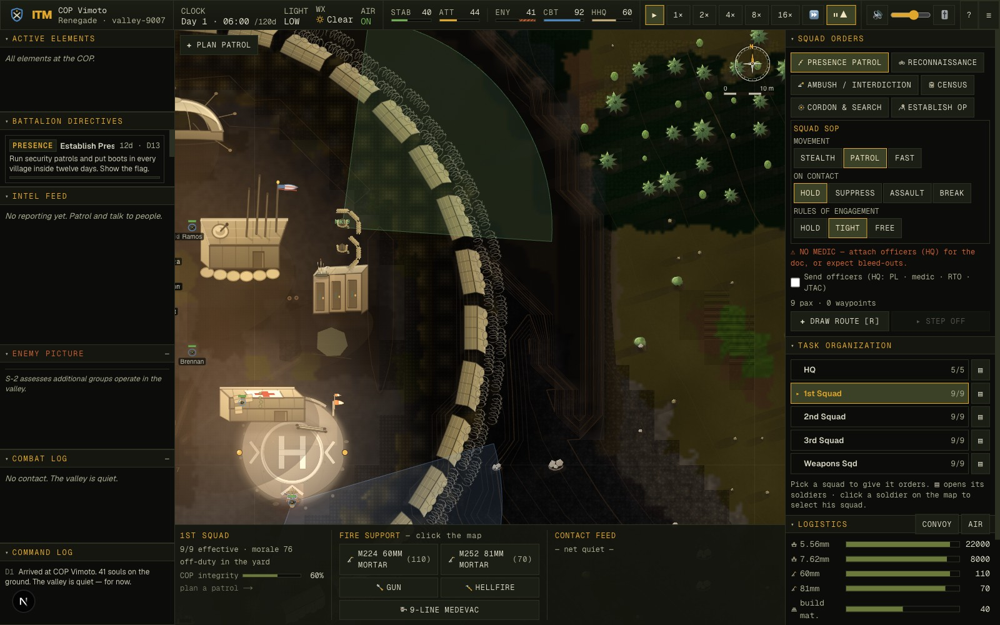

<div align="center">

# In the Mountains

### One valley. One clock. No respawns.

A continuous real-time simulation of counterinsurgency at a remote combat outpost in a
procedurally generated Korengal-like valley, Afghanistan, c. 2011 — resolved to **5-metre
fidelity**, where every bullet is a projectile, every soldier has a name, and winning
means logistics and patience as much as firefights.






</div>

There are no turns and no phases: one master clock runs the sun, the weather, the supply
trucks, the enemy's tempo, and every round in flight. Soldiers kit up at the wire before a
patrol steps off. Combat slows the clock to readable speed; the quiet hours fast-forward.
The hardest part of command is watching.

Inspired by Sebastian Junger's *War*, the documentaries *Restrepo* and *Korengal*, Jake
Tapper's *The Outpost*, and counterinsurgency doctrine (FM 3-24). This is a study of a
hard, real war, built with the somber intent of its sources rather than as a power fantasy:
losses are permanent, civilian harm radicalizes the valley, and you can win every firefight
and still lose.

## Quick start

```bash
npm install
npm run dev      # http://localhost:3000
```

Click **Deploy** for a new tour (or **Guided Tutorial**). **Space** pauses, **1–5** set
speed, **T** fast-forwards until something needs you. The **Field Manual**
(`/manual/index.html`), **Interactive Tutorial**, and **Development Archive** — the
illustrated, chronological story of how the game was built, shipped inside the app because
transparency is a feature — are all linked from the title screen.

## The valley

A ~2.5 km valley on a 5-metre grid with 21 landcover classes — river, marsh, dry washes,
irrigated cropland, terraced fields and their stone walls, orchards, scree, cliffs, walled
compounds, cemeteries, roads, trails, footbridges — each with its own cover, concealment,
and movement cost. Both sides route over it with terrain-aware A*, and both choose a
**posture**: *Concealed* hugs the forest and the washes, slow and hard to spot; *Rush* is
fast, loud, and exposed.

Line of sight is elevation ray-casting with partial defilade, canopy concealment, and
dynamic smoke. Every round fired is a real projectile — muzzle velocity, time of flight,
dispersion folded from weapon mechanics, marksmanship, stance, fatigue, and suppression.

The terrain renders in a **WebGL2 HDR underlayer**: the valley floor recomposed per-pixel
from the sim's own landcover arrays, lit by the live master-clock sun — linear-space
sun/sky/moon lighting, baked horizon AO, multi-kilometre cast ridge shadows, a
flow-advected river, aerial perspective, god-rays, ACES tonemap — under a transparent
Canvas-2D layer for contours, units, and HUD, with an alive 2D-bake fallback when WebGL2
is unavailable.

## The enemy

The insurgency is a persistent **order of battle**, not a spawn table. Three to five cells
with named leaders who survive between fights — kill one and the cell renames, weakens,
and remembers. They keep home ground in the draws, physical munitions caches that IED
ambushes drain, and a **patrol-heat memory** of your habits: predictable routes get IED'd.

You never see their ground truth. An **intel ladder** (unknown → named → located → mapped)
is climbed by ICOM intercepts, drone cues, and — above all — won-over villages giving
their cell up. A weekly commander's assessment explains the week's cause and effect.

Group minds decide and individuals execute, on both sides. Insurgent cells fight as led
elements: a disciplined one-volley ambush initiation, fire-and-movement by halves, a
coordinated peel to a shared rally. Your squad leader runs the firefight — base of fire
and maneuver, bounding pairs with per-man nerve — and raises calls-for-fire like a real
forward observer, only onto a positively identified, observed enemy, never inside his own
danger-close radius. You approve or deny. What the men shout — *"contact left!"*,
*"man down!"* — surfaces as callouts on the map.

## The people

Named soldiers with attributes, morale, suppression, fatigue, regional wounds under body
armor, bleeding, buddy aid, and medics. Losses are permanent.

Civilians keep a pattern of life: a diurnal rhythm, the melt-away tell before an ambush,
kids trailing a friendly patrol. And the villages are the real game. Attitudes move
through presence, shuras where elders make asks you keep or break (broken promises hurt
more than kept ones help), and CERP projects that must be **secured for days of
construction** — materials trucked in, contractor and labor on site — or the insurgents
intimidate the crew. A civilian casualty of your fire becomes a **named blood debt**: a
first-light funeral, a sympathy floor, solatia settled by name. The end-of-tour score
grades counterinsurgency, not body count.

## The sound

One hundred percent synthesized — no audio assets. Calibre-true gunfire (the .50s hammer
an octave below the 7.62s, bolt guns cycle their bolts, men audibly swap mags in a lull)
with the crack-thump split and terrain-occluded reports; a valley reverb off the
ridgelines; the incoming-shell whistle before a fire mission lands; IEDs that heave the
ground; and a living ambient bed — wind, river, the COP generator, birds, dogs, the adhan,
rain — that ducks hard when contact starts.

## Verifying the engine

The engine is pure, deterministic TypeScript with seeded RNG: a seed reproduces the valley
and, given the same inputs, the same outcomes. It runs headless, and the repo carries 50+
probe scripts that exercise one subsystem each:

```bash
npx tsx scripts/smoke.ts          # build a world, send a patrol, run 30 game-min, print the play-by-play
npx tsx scripts/balance.ts 12 45  # 12 deployments × 45 game-min: casualties & stall check
```

CI runs typecheck → build → smoke → balance on every push.

## Project structure

Strict three layers, one bridge: the React-free engine (`lib/sim`), React-free renderers
(`lib/render`, `lib/audio`), and the single Zustand bridge (`state/store.ts`).

<details>
<summary><b>Full tree</b></summary>

```
lib/sim/            Pure simulation engine (no React)
  rng.ts            Seeded RNG + value noise
  vec.ts            Vector / grid math
  terrain.ts        Procedural 5 m valley + landcover classes + queries
  path.ts           Terrain-aware A* foot pathfinding (concealment bias)
  los.ts            Line of sight, concealment, detection (posture-aware)
  weapons.ts        US + insurgent weapon catalog
  ballistics.ts     Projectile + hit + wound model
  entities.ts       Soldiers / insurgents / civilians + factories + move postures
  combat.ts         Unit-level tick: perception, fire, projectiles, morale, fire support
  ai/               squad-combat.ts + cell-combat.ts (the two group minds) · friendly.ts · insurgent.ts · civilian.ts
  campaign.ts       Campaign types + helpers (supplies, villages, grievances, weather)
  world/            The continuous world — world.ts is the master clock; director.ts the enemy
                    activity director; directives.ts, tasks.ts, projects.ts, events.ts
lib/render/         WebGL2 terrain underlayer + Canvas-2D HUD; ~160-asset SVG sprite/LOD system
  gl/               Two-pass HDR terrain pipeline (terrain-gl.ts, shaders.ts, material-atlas.ts)
  sky.ts            Verified solar model (δ=+21° Kunar) + sprite shadow geometry
  atmosphere-model.ts  Floor-field valley fog
  sprites.ts / draw.ts / decoration.ts / topo.ts / callouts.ts
lib/audio/          Procedural soundscape — pure cue mappers (headless) + browser synths/reverb/buses
state/store.ts      Zustand store bridging React ↔ the World (the real-time frame loop)
components/         WorldView (the live map), screens, in-game tutorial
public/manual/      Field manual, tutorial, and the shipped Development Archive
docs/               Design doc + wiki · scripts/ holds the headless probe harnesses
```

</details>

## Documentation

- [`docs/DESIGN.md`](docs/DESIGN.md) — the master design document
- [`docs/wiki/`](docs/wiki/) — systems, AI, campaign, architecture, glossary
- `/manual/archive/` in the running app — the illustrated development history
- Debug handle: `window.__ITM.getState().world` is the live `World`

---

<sub>MIT · Built by Elliot Himmelfarb with <a href="https://claude.com/claude-code">Claude Code</a></sub>
